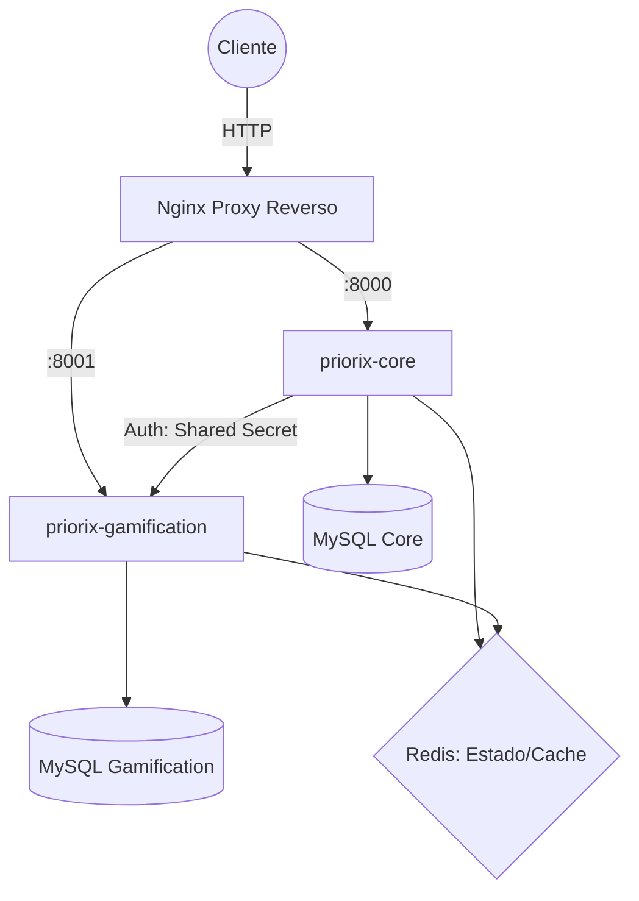
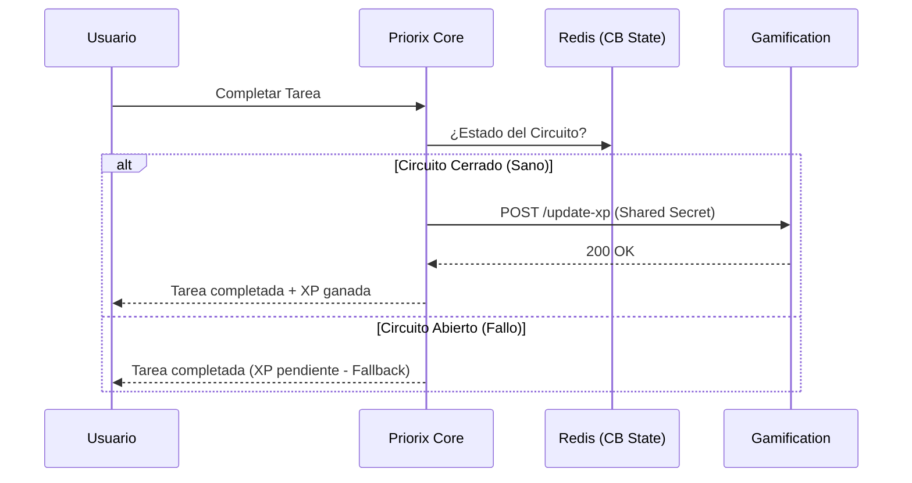

# Priorix:

Priorix es una plataforma de gestión de productividad que integra dinámicas de **gamificación** para incentivar el cumplimiento de tareas. Este documento detalla la transición de un sistema acoplado a una arquitectura de microservicios resiliente y observable, cumpliendo con los requisitos de documentación técnica establecidos.

## 1. Descripción del Sistema

El sistema permite a los usuarios planificar actividades diarias mientras una "mascota digital" evoluciona basada en su rendimiento. El objetivo técnico es garantizar que la funcionalidad crítica (gestión de tareas) permanezca operativa incluso si los servicios complementarios (gamificación/estadísticas) presentan fallos.

## 2. Arquitectura Inicial

En la etapa inicial, el sistema presentaba un diseño con lógica de negocio y gamificación estrechamente vinculadas:

- **Punto único de fallo**: Una excepción en el motor de XP bloqueaba la creación o finalización de tareas.
- **Escalabilidad limitada**: No era posible escalar el servicio de gamificación de forma independiente ante picos de uso.
- **Acoplamiento de datos**: Uso de una base de datos compartida que dificultaba la evolución independiente de los esquemas.

## 3. Arquitectura Evolucionada

Se migró hacia una arquitectura de **microservicios desacoplados** utilizando contenedores Docker.

### Diagrama de Arquitectura General

- **Decisión clave**: Se implementó el patrón _Database-per-Service_ para asegurar que `priorix-core` y `priorix-gamification` sean totalmente autónomos.
- **Proxy Reverso**: Nginx actúa como única puerta de entrada (API Gateway), ocultando la topología interna y centralizando el acceso.

## 4. Investigación sobre Resiliencia

La resiliencia del sistema se fundamenta en el patrón **Circuit Breaker (Disyuntor)** para gestionar la comunicación inter-servicio.

### Implementación del Circuit Breaker

Utilizamos **Redis** como almacén de estado distribuido para que el conocimiento sobre la salud de los servicios persista entre diferentes peticiones PHP.

- **Estado OPEN**: Si el servicio de gamificación falla 3 veces consecutivas, el circuito se abre y el Core deja de intentar comunicarse por 30 segundos, evitando la acumulación de timeouts.
- **Degradación Controlada (Fallback)**: Cuando el circuito está abierto, el sistema responde con datos predefinidos ("fallback"). El usuario puede completar su tarea con éxito; la sincronización de XP se posterga, garantizando que el negocio principal nunca se detenga.

## 5. Seguridad Implementada

La seguridad se diseñó en capas para proteger tanto el acceso externo como interno:

- **Identidad (JWT)**: Autenticación _stateless_ para usuarios mediante tokens firmados. Se implementó una **blacklist en Redis** para permitir la revocación inmediata de tokens en el cierre de sesión.
- **Confianza Interna (Shared Secret)**: La comunicación entre microservicios requiere el encabezado `X-Internal-Service-Secret`. Esto evita que un usuario pueda manipular sus estadísticas directamente consumiendo la API de gamificación.

## 6. Observabilidad Implementada

Implementamos los tres pilares para garantizar que el sistema sea diagnosticable en todo momento:

- **Métricas (Prometheus + Grafana)**: Monitoreo de latencia y estado del Circuit Breaker en tiempo real.
- **Trazabilidad Distribuida (OpenTelemetry + Jaeger)**: Seguimiento del ciclo de vida de una petición (ej. completar actividad) a través de los servicios.
- **Logs Estructurados**: Registro semántico en Redis sobre cambios de estado críticos, como la apertura de circuitos.

## 7. Diagramas de Interacción

### Flujo de Finalización de Tarea Resiliente

## 8. Evidencia de Funcionalidades Cubiertas

- **Independencia de Servicios**: Probada mediante el apagado del contenedor de gamificación; el Core sigue operativo respondiendo con fallbacks.
- **Seguridad de API**: Verificación de rechazo de peticiones sin secreto compartido.
- **Monitoreo**: Endpoints `/metrics` funcionales y consumibles por el stack de observabilidad.

## 9. Stack Tecnológico

| Componente         | Tecnología                  | Propósito                                 |
| :----------------- | :-------------------------- | :---------------------------------------- |
| **Framework**      | Laravel 11 / PHP 8.3        | API REST y lógica de negocio              |
| **Bases de Datos** | MySQL 8.0 (x2)              | Persistencia por servicio                 |
| **Estado y Caché** | Redis                       | Circuit Breaker, JWT blacklist y métricas |
| **Proxy Reverso**  | Nginx                       | Puerta de entrada única y enrutamiento    |
| **Observabilidad** | Prometheus, Grafana, Jaeger | Monitoreo y trazabilidad                  |

---
